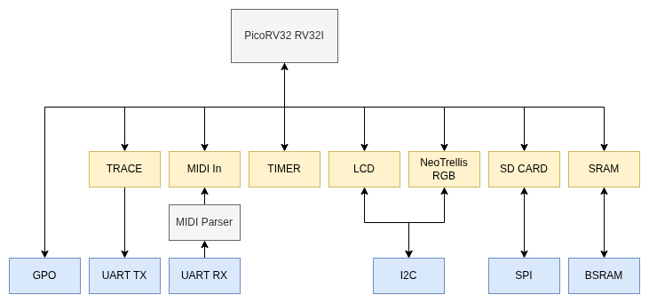

# TangNano9K SOC
This is a small SOC for the Sipeed TangNano9K development board hosting the Gowin Semiconductors GW1AR-9 FPGA.  

This is a relatively perfunctory README as I assume anybody who is planning on building an FPGA based SOC has some idea what they are doing, this is not a project for novices.  I do not go into detail and assume that you largely know how to setup your build toolchain.

I do all my development on Linux so there is no Windows support here.

The SOC uses the very lightweight Picorv32 soft-core processor created by Clifford Wolfe (Yosys).  

To this, Ive added a limited set of MMIO peripherals as my primary purpose for this SOC is to manage simple control-plane functions for FPGA based digital synthesisers.

The RV variant is the 32-bit RV32IMC which includes the hardware multiplier/divider, barrel shifter and compressed instruction set. I do not enable the custom IRQ mechanism provided by the MCU.

I provide the following mative memory mapped (MMIO) hardware modules and drivers:

| Module | Notes |
| -------| ------|
| GPO    | 16 pin GPO output|
| TIMER  | 64 bit counter based timer |
| TRACE  | Serial TX tracing functionality |
| MIDI   | Serial RX MIDI and parser |
| I2C    | Standard I2S peripheral |
| SPI    | Standard SPI peripheral |
| SRAM   | Static RAM 8K |

*Note: there is no I2S MMIO module.  The I2S HDL module in the codebase is intended for use directly by the hardware DSP signal chain and does not involve the softcore MCU.*

In addition I provide software drivers for:

| Driver  | Notes  |
| ------- |------- |
| LCD     | The Hitachi 2/4 line LCD character display (I2C)|
| Button  | Button decoding/debouncing|
| Encoder | Quad encoder decoding|
| SD Card | SD Card read/write (SPI)|
| Trellis | Adafruit Neo-Trellis 4x4 (I2C)|



## Tooling
I use a Docker image and VS Code Devcontainer to host my development environment.  

The docker config and build scripts can be found in my ```Dev-Container``` repository.  You need to build the Gowin docker image which includes all the tooling needed for building this project.

There is a small resource layer added by VSCode when the container opens which provides some glue to interface with the OS.

If you don't want to use this then you can look at the Dockerfile to see what packages need to be installed and install them directly onto your OS.

You can run the Gowin EDA IDE (gw_ide) and Gtkwave tool with GUI, sufficient Qt/X11 support is included for this.

The build uses the gw_sh utility which is the TCL CLI tooling for Gowin EDA.

The Gowin programmer does not work on Ubuntu so I use the openFPGALoader alternative for programming/flashing the FPGA.  

For this same reason, the Gowin GOA (similar to Xilinx ChipScope), which relies on the JTag connection provided by their programmer, does not work.  You'll a Windows PC to use this.  I just use a logic analyser and toggle pins.

The project will build using the Yosys open source tooling (I have an alternative container for these tools) however you will need to modify the build scripts.  I ended up using the Gowin EDA tools for reasons that I forget and have no inclination to change this.

## Structure & Build
The project provides both the hardware and software for the SOC as a typical co-development.

The ```sw``` folder contains the firmware, written in C.  This needs to be built first as it is used to configure the BSRAM memory in the HW build.

The firmware is configured as a CMake project.  To build the firmware:

```bash
cd sw
cmake --preset debug   # This will configure CMake
cmake --build --preset debug --verbose  # Build
```

The build will copy 4 hex firmware files into the ```hw/handoff``` folder where they are used by the subsequent hardware builds.

The ```hw``` folder contains the HDL (RTL and testbenches) for the SOC modules and soft-core MCU, this is built using the Gowin EDA TCL based tools.  

```bash
# To build the project use the following command or the task provided for VS code (Ctrl-P - Run Task - Build & Program)

cd hw/tools
gw_sh build.tcl -build
```
This will build the HDL and program the board.  To make the programming permanent you need to use the -flash option.

# Documentation
There are additional docs in the ```docs``` folder pertaining to the SOC modules and their registers/programming API.